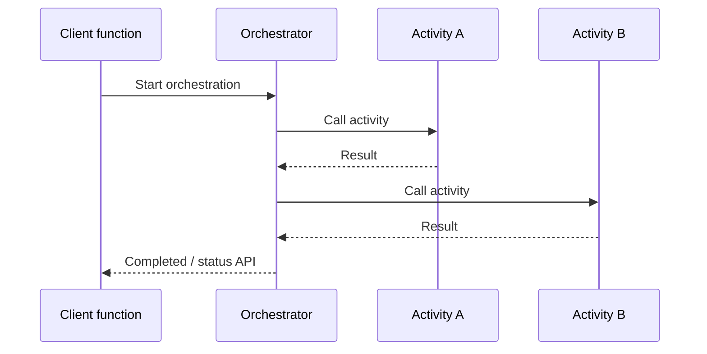
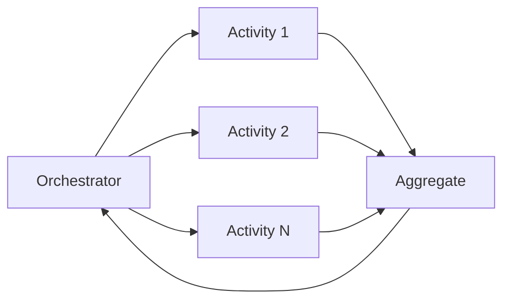

# Azure Functions — Durable Functions (Conceptual)

## Series

1. [Triggers & Bindings](../azure-functions--triggers-bindings/)
2. [Hosting Plans](../azure-functions--hosting-plans/)
3. [Isolated Worker](../azure-functions--isolated-worker/)
4. **Durable Functions** (this node)
5. [Practice](../azure-functions--practice/)
6. [Best Practices](../azure-functions--best-practices/)

**Prev:** [← Isolated Worker](../azure-functions--isolated-worker/) ·
**Next:** [Practice →](../azure-functions--practice/)

## What it demonstrates

Durable Functions as a **reliability and orchestration** layer on top of Azure
Functions: you write workflows in code, and the runtime persists progress so long-
running, multi-step work survives process restarts — without you hand-rolling state
machines and queues.

This node is **conceptual only** (no Durable host project). Use it to know *when*
to reach for Durable and how the pieces fit.

## Key ideas

### Three function roles

| Role | Job | Constraints |
|------|-----|-------------|
| **Orchestrator** | Describes the workflow: call activities, wait, branch, fan-out | Must be **deterministic** (replay-safe). No I/O, no random, no direct DateTime.Now for control flow. |
| **Activity** | Does the real work (HTTP call, DB write, transform) | Normal code; make it **idempotent** (at-least-once). |
| **Entity** | Small durable state + operations (counters, locks, aggregators) | Addressable by entity id; useful for shared mutable state. |

A fourth shape you will see in samples: a **client** function (often HTTP) that
*starts* an orchestration and returns a status URL.

### Fan-out / fan-in

Classic parallel pattern:

1. **Fan-out** — schedule many activities (or sub-orchestrations) concurrently.
2. **Fan-in** — wait for all (or some) to finish, then aggregate results.

Use it when each work item is independent and throughput matters. Remember: fan-in
aggregation runs in the orchestrator instance — if the aggregate step is huge,
split with sub-orchestrations.

### When to reach for Durable

| Reach for Durable when… | Prefer plain Functions / other tools when… |
|-------------------------|--------------------------------------------|
| Multi-step workflow must survive crashes and restarts | Single trigger → process → done |
| You need durable timers, human approval waits, or external events | Simple CRON (Timer trigger is enough) |
| Fan-out/fan-in across many items with reliable join | Fire-and-forget queue consumers with no join |
| Compensating transactions / saga-style steps | Stateless glue between two services |
| Shared small state via **entities** | Full database is the source of truth already |

**Not** a reason by itself: “I have an HTTP API.” That is still often App Service /
minimal APIs unless the HTTP call only *starts* a long workflow.

### Storage / hosting note (awareness)

Orchestration state lives in a durable store (Azure Storage historically; **Durable
Task Scheduler** is the modern recommendation for performance). Hosting still uses
normal Functions plans (Flex / Premium / Dedicated, etc.) — see
[Hosting Plans](../azure-functions--hosting-plans/).

## How to use

No runnable Durable project in this node. After
[Practice](../azure-functions--practice/), follow the Learn quickstarts below when you
are ready to implement an orchestrator + activities.

## References

- [What are Durable Functions?](https://learn.microsoft.com/azure/azure-functions/durable/durable-functions-overview)
- [Programming model overview](https://learn.microsoft.com/azure/durable-task/common/programming-model-overview)
- [Fan-out/fan-in pattern](https://learn.microsoft.com/azure/durable-task/common/durable-task-fan-in-fan-out)
- [Entity functions](https://learn.microsoft.com/azure/azure-functions/durable/durable-functions-entities)
- [Orchestrator code constraints](https://learn.microsoft.com/azure/durable-task/common/durable-task-code-constraints)
- [Durable Task Scheduler](https://learn.microsoft.com/azure/durable-task/scheduler/durable-task-scheduler)
