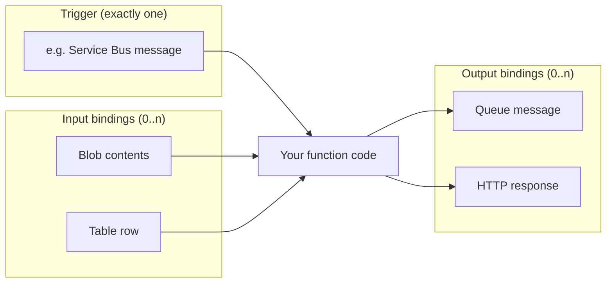

# Azure Functions — Triggers & Bindings

## Series

1. **Triggers & Bindings** (this node)
2. [Hosting Plans](../azure-functions--hosting-plans/)
3. [Isolated Worker](../azure-functions--isolated-worker/)
4. [Durable Functions](../azure-functions--durable/)
5. [Practice](../azure-functions--practice/)
6. [Best Practices](../azure-functions--best-practices/)

**Next:** [Hosting Plans →](../azure-functions--hosting-plans/)

## What it demonstrates

How Azure Functions are invoked and how they talk to other Azure services
**declaratively** — via a trigger (exactly one) and optional input/output bindings —
instead of hand-rolling every client connection.

## Key ideas

- A **trigger** starts the function. Every function has **exactly one** trigger.
- A **binding** declaratively connects a parameter (or return value) to a resource.
  - **Input binding** — data is *read into* the function for you.
  - **Output binding** — data is *written out* from the function for you.
- The trigger itself is a special kind of input binding (it both fires the function
  and usually supplies a payload).
- You are not required to use bindings; you can create SDK clients in code (often
  with DI). Bindings shine for simple “glue” scenarios.

### Common triggers (cheat sheet)

| Trigger | Fires when… | Typical use |
|---------|-------------|-------------|
| **HTTP** | An HTTP request hits the function URL | Webhooks, light APIs, health checks |
| **Timer** | A CRON schedule elapses | Nightly jobs, polling fallbacks |
| **Service Bus** | A queue/topic message is available | Reliable async work between systems |
| **Queue (Storage)** | A Storage queue message arrives | Lightweight async decoupling |
| **Blob** | A blob is created/updated (prefer Event Grid source for scale) | File/image pipelines |

### Input vs output



| Direction | Responsibility | Mental model |
|-----------|----------------|--------------|
| Trigger / input | Runtime *pulls* data and injects it as a parameter | “Give me this when I run” |
| Output | Runtime *pushes* return value / attributed property | “Send this when I finish” |

Example shape (isolated worker attributes — see [Practice](../azure-functions--practice/) for full projects):

```csharp
// Trigger: HTTP request arrives
// Output: response body via IActionResult (ASP.NET Core integration)
[Function("Hello")]
public IActionResult Run(
    [HttpTrigger(AuthorizationLevel.Function, "get")] HttpRequest req)
    => new OkObjectResult("ok");
```

```csharp
// Trigger: Service Bus message
// (no extra input binding; message body *is* the trigger payload)
[Function("ProcessOrder")]
public void Run(
    [ServiceBusTrigger("orders", Connection = "ServiceBusConnection")]
    string message)
{ /* ... */ }
```

### Composition patterns

| Scenario | Trigger | Input | Output |
|----------|---------|-------|--------|
| Queue → another queue | Queue A | — | Queue B |
| Nightly report from blobs | Timer | Blob | Cosmos DB / email |
| Webhook that enqueues work | HTTP | — | Service Bus / Queue |

### When is a Function the right tool? (preview)

Prefer a Function when the workload is **event-driven**, **scheduled**, or **glue
between systems** — “run this because something happened,” not “host my entire
product API.” Prefer a dedicated Web API (ASP.NET, App Service, Container Apps)
when you need a rich, always-on HTTP surface, complex middleware, or long-lived
connections. Full decision guidance lives in
[Best Practices](../azure-functions--best-practices/).

## How to use

There is no runnable project in this node. Read the tables and diagram, then follow
the series into hosting and the isolated worker model. Hands-on HTTP + Service Bus
code is in [Practice](../azure-functions--practice/).

## References

- [Azure Functions triggers and bindings](https://learn.microsoft.com/azure/azure-functions/functions-triggers-bindings)
- [HTTP trigger](https://learn.microsoft.com/azure/azure-functions/functions-bindings-http-webhook-trigger)
- [Timer trigger](https://learn.microsoft.com/azure/azure-functions/functions-bindings-timer)
- [Service Bus trigger](https://learn.microsoft.com/azure/azure-functions/functions-bindings-service-bus-trigger)
- [Storage Queue trigger](https://learn.microsoft.com/azure/azure-functions/functions-bindings-storage-queue-trigger)
- [Blob trigger](https://learn.microsoft.com/azure/azure-functions/functions-bindings-storage-blob-trigger)
- [Azure Functions scenarios](https://learn.microsoft.com/azure/azure-functions/functions-scenarios)
