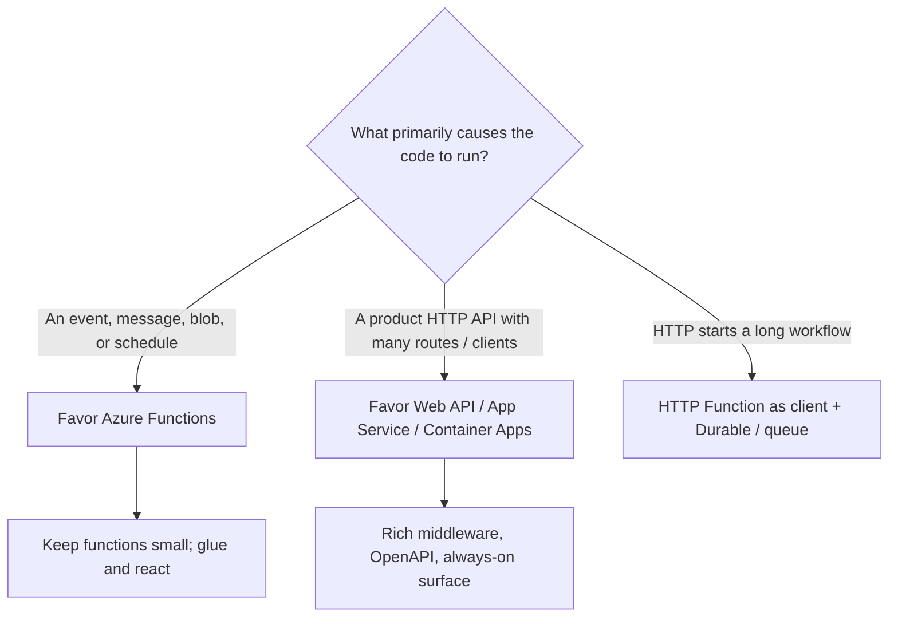

# Azure Functions — Best Practices

## Series

1. [Triggers & Bindings](../azure-functions-triggers-bindings/)
2. [Hosting Plans](../azure-functions-hosting-plans/)
3. [Isolated Worker](../azure-functions-isolated-worker/)
4. [Durable Functions](../azure-functions-durable/)
5. [Practice](../azure-functions-practice/)
6. **Best Practices** (this node)

**Prev:** [← Practice](../azure-functions-practice/)

## What it demonstrates

Cross-cutting decisions for Azure Functions on .NET: when a Function beats (or loses
to) an API endpoint, how to choose hosting and process model, and a short checklist
that ties the series together.

## Key ideas

### Function vs API endpoint

| Prefer **Functions** when… | Prefer an **API host** when… |
|----------------------------|------------------------------|
| Work is **event-driven** (queue, SB, Event Grid, blob) | Clients expect a stable, rich REST/Graph surface |
| Work is **scheduled** (Timer) | You need heavy middleware, complex auth policies, SignalR, gRPC streams |
| You are **gluing systems** (ingest → transform → emit) | Cold starts or scale-to-zero would hurt UX |
| Scale-to-zero and pay-per-use matter | Team already runs App Service / AKS for the same domain |
| One trigger → focused handler | Dozens of tightly coupled endpoints sharing request pipeline |

HTTP-triggered Functions are fine for webhooks, admin ops, and thin adapters —
stretching them into a full public API platform is usually the wrong shape.

### Series checklist (can you explain…?)

- [ ] Trigger vs input vs output binding; exactly one trigger per function —
      [Triggers & Bindings](../azure-functions-triggers-bindings/)
- [ ] Consumption (legacy) vs Flex vs Premium (EP) vs Dedicated; cold-start trade-offs —
      [Hosting Plans](../azure-functions-hosting-plans/)
- [ ] Why **isolated** is default; in-process retirement date —
      [Isolated Worker](../azure-functions-isolated-worker/)
- [ ] Orchestrator / activity / entity; fan-out/fan-in; when Durable pays off —
      [Durable Functions](../azure-functions-durable/)
- [ ] Built HTTP + Service Bus functions with DI, `ILogger`, app settings —
      [Practice](../azure-functions-practice/)

### Reliability & ops (short list)

| Practice | Why |
|----------|-----|
| Prefer **Flex Consumption** for new serverless apps | Current recommended dynamic plan; VNet + optional always-ready |
| Prefer **identity-based connections** (MI + RBAC) over connection strings in Azure | Matches Key Vault / Entra guidance; fewer secrets |
| Put business logic in injectable services; unit-test it | Host is awkward to unit-test; pure logic isn’t |
| Keep functions **idempotent** where triggers can replay | At-least-once delivery is common |
| Enable Application Insights / OpenTelemetry | Diagnosing scale and failures without it is guesswork |
| Don’t use Functions as a dumping ground for long monolithic APIs | Fight the “one giant Function App” instinct |
| Reach for Durable when you need durable multi-step workflows — not for every `async` method | Orchestrators have constraints; activities do the I/O |

### Security snapshot

- HTTP: default toward `AuthorizationLevel.Function` (or stronger); avoid anonymous
  except intentional public webhooks with their own verification.
- Service Bus / Storage: grant least-privilege RBAC (e.g. **Azure Service Bus Data
  Receiver** for a queue trigger).
- Config: app settings / Key Vault references — never commit secrets (see
  `local.settings.json` gitignore in [Practice](../azure-functions-practice/)).

## How to use

Skim this node after finishing Practice. Use the checklist as a flash-card pass.
Deep links for each topic live in the earlier nodes’ References sections.

## References

- [Best practices for reliable Azure Functions](https://learn.microsoft.com/azure/azure-functions/functions-best-practices)
- [Azure Functions scenarios](https://learn.microsoft.com/azure/azure-functions/functions-scenarios)
- [Identity-based connections](https://learn.microsoft.com/azure/azure-functions/functions-reference#connections)
- [Hosting options](https://learn.microsoft.com/azure/azure-functions/functions-scale)
