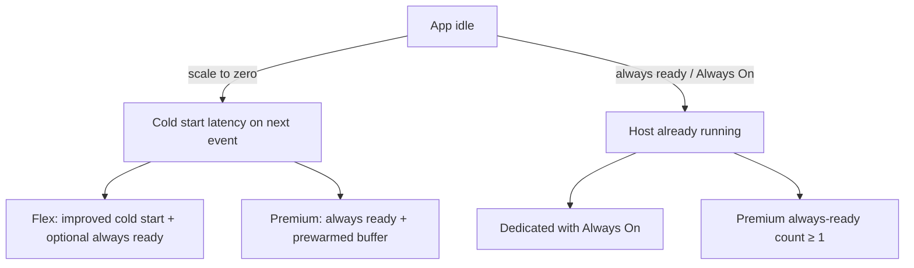
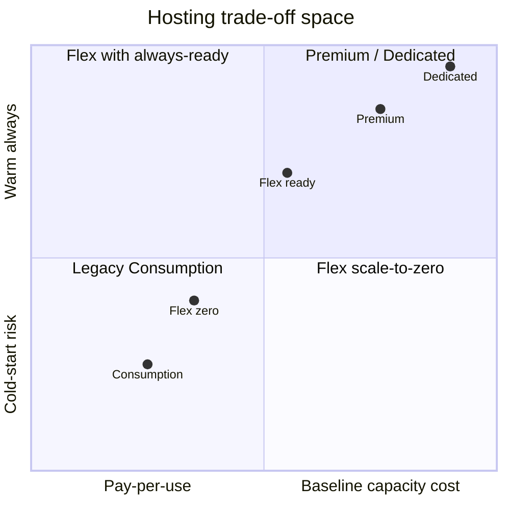

# Azure Functions — Hosting Plans

## Series

1. [Triggers & Bindings](../azure-functions-triggers-bindings/)
2. **Hosting Plans** (this node)
3. [Isolated Worker](../azure-functions-isolated-worker/)
4. [Durable Functions](../azure-functions-durable/)
5. [Practice](../azure-functions-practice/)
6. [Best Practices](../azure-functions-best-practices/)

**Prev:** [← Triggers & Bindings](../azure-functions-triggers-bindings/) ·
**Next:** [Isolated Worker →](../azure-functions-isolated-worker/)

## What it demonstrates

How the **hosting plan** chooses scale behavior, cold-start risk, networking
options, and billing — and how the classic trio
**Consumption / Premium / App Service (Dedicated)** maps onto today’s Azure lineup
(including **Flex Consumption** as the modern serverless default).

## Key ideas

The plan answers: *Who pays for idle capacity? How far can we scale to zero? Who
owns the VNet story?*

### Classic mental model (still how people talk about it)

| Plan | Scale | Cold start | Billing vibe | Reach for it when… |
|------|-------|------------|--------------|--------------------|
| **Consumption** (legacy dynamic) | Scale to zero; event-driven | Noticeable after idle | Pay per execution + GB-s | Spiky, infrequent work; latency OK |
| **Premium** (Elastic Premium / EP*) | Dynamic scale; min instances | Mitigated / avoided with always-ready | Always ≥1 billed instance | Continuous or near-continuous load; need VNet; longer runs |
| **App Service / Dedicated** | Fixed (or autoscale rules); Always On | Not really an issue if Always On | App Service VM pricing | Co-host with web apps; predictable capacity |

> **Naming trap:** Elastic Premium SKUs are `EP1`, `EP2`, … App Service “Premium”
> SKUs like `P1v3` are **Dedicated**, not Elastic Premium — they do **not** do
> Functions event-driven scale the same way.

### Current Azure lineup (what you should say in 2026)

Microsoft now documents these primary options
([hosting options](https://learn.microsoft.com/azure/azure-functions/functions-scale)):

| Option | Role |
|--------|------|
| **Flex Consumption** | **Recommended serverless** for new apps. Dynamic scale, VNet, pay-as-you-go, optional **always ready** instances. |
| **Premium** (Elastic Premium) | Always-ready + prewarmed instances; predictable base cost; VNet; longer durations. |
| **Dedicated** (App Service plan) | Run on App Service infrastructure; Always On; cold start largely irrelevant. |
| **Consumption** (legacy) | Older dynamic plan. Prefer Flex for new work; migrate existing apps when ready. |
| **Container Apps** | Functions-in-containers; cold start depends on min replicas. |

Map the interview trio this way:

- “Consumption” → **Flex Consumption** (modern) / legacy Consumption (older docs)
- “Premium” → **Elastic Premium (EP)**
- “App Service plan” → **Dedicated**

### Cold start trade-offs

| Plan | Cold start reality |
|------|--------------------|
| Legacy Consumption | Scales to zero → first request after idle pays specialization cost. Worse for sync HTTP than for async queue/timer. |
| Flex Consumption | Better cold-start behavior than classic Consumption; optional always-ready instances shrink delay further. |
| Premium | Always-ready instances keep a warm floor; prewarmed buffer helps HTTP scale-out. |
| Dedicated | With Always On, the host stays up — cold start is rarely the problem. |

**Rule of thumb:** if an HTTP caller waits on your function and p99 latency matters,
don’t bet the design on scale-to-zero alone — use Flex always-ready, Premium, or
Dedicated. Async messaging (Service Bus, Queue) often tolerates cold start better.

### Cost / ops at a glance

## How to use

No code in this node. When you create a Function App in the
[Practice](../azure-functions-practice/) runbook, you will use **Flex Consumption**
(`az functionapp create ... --flexconsumption-location ...`) — the current default
for new serverless apps.

## References

- [Azure Functions hosting options](https://learn.microsoft.com/azure/azure-functions/functions-scale)
- [Flex Consumption plan](https://learn.microsoft.com/azure/azure-functions/flex-consumption-plan)
- [Premium plan](https://learn.microsoft.com/azure/azure-functions/functions-premium-plan)
- [Dedicated plan](https://learn.microsoft.com/azure/azure-functions/dedicated-plan)
- [Consumption plan (legacy)](https://learn.microsoft.com/azure/azure-functions/consumption-plan)
- [Cold start / event-driven scaling](https://learn.microsoft.com/azure/azure-functions/event-driven-scaling#cold-start)
- [Reliable Functions — choose the plan](https://learn.microsoft.com/azure/azure-functions/functions-best-practices#choose-the-correct-hosting-plan)
