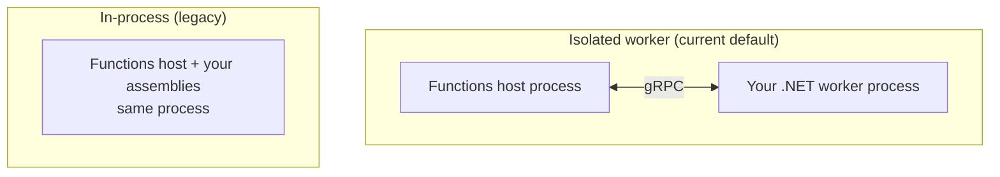

# Azure Functions — Isolated Worker (.NET)

## Series

1. [Triggers & Bindings](../azure-functions-triggers-bindings/)
2. [Hosting Plans](../azure-functions-hosting-plans/)
3. **Isolated Worker** (this node)
4. [Durable Functions](../azure-functions-durable/)
5. [Practice](../azure-functions-practice/)
6. [Best Practices](../azure-functions-best-practices/)

**Prev:** [← Hosting Plans](../azure-functions-hosting-plans/) ·
**Next:** [Durable Functions →](../azure-functions-durable/)

## What it demonstrates

Why **.NET isolated worker** is the current default for Azure Functions C#: your
function code runs in a **separate process** from the Functions host, which
unlocks modern .NET versions, cleaner DI, and a sustainable extension model —
while **in-process** (same process as the host) is being retired.

## Key ideas

### Process models



| | **Isolated worker** | **In-process** |
|--|---------------------|----------------|
| Process | Worker process separate from host | Your code loads into the host |
| Packages | `Microsoft.Azure.Functions.Worker.*` | `Microsoft.Azure.WebJobs.*` |
| .NET versions | Current / LTS of your choice (host decoupled) | Tied to what the host ships |
| DI / middleware | First-class `Host` builder, familiar to ASP.NET Core | More constrained host DI |
| HTTP types | `HttpRequestData` / `HttpResponseData`, or ASP.NET Core `HttpRequest` / `IActionResult` | `HttpRequest` / `IActionResult` |
| Status | **Recommended / default for new apps** | **Support ends November 10, 2026** |

### Why isolated is the default — say this out loud

1. **Decoupling from the host.** You are no longer blocked waiting for the Functions
   host to adopt a new .NET version. That made LTS and non-LTS targets practical.
2. **Modern .NET ecosystem fit.** Middleware, DI, configuration, and OpenTelemetry
   look like ordinary .NET worker / web apps — see
   [Practice](../azure-functions-practice/) `Program.cs`.
3. **Extension / SDK direction.** New binding investments and samples prioritize
   `Microsoft.Azure.Functions.Worker.Extensions.*`.
4. **Retirement clock.** In-process support ends **2026-11-10**. Greenfield code
   should not start there; brownfield should
   [migrate](https://learn.microsoft.com/azure/azure-functions/migrate-dotnet-to-isolated-model).

### Mental model for bindings in isolated

- Attributes still declare triggers/bindings on methods and parameters.
- Output bindings use **return values** (and custom types for multiple outputs).
- Prefer constructor injection for services and `ILogger<T>`; avoid static function
  classes for new code.

```csharp
public sealed class HelloHttp(ILogger<HelloHttp> logger)
{
    [Function(nameof(HelloHttp))]
    public IActionResult Run(
        [HttpTrigger(AuthorizationLevel.Function, "get")] HttpRequest req)
    {
        logger.LogInformation("Invoked");
        return new OkObjectResult("ok");
    }
}
```

### What you no longer lean on from in-process

| In-process habit | Isolated approach |
|------------------|-------------------|
| `IAsyncCollector<T>` for many outputs | Return arrays / multi-output POCOs |
| Imperative binding at runtime | Register Azure SDK clients in DI |
| Host-shared App Domain assumptions | Treat the worker like any out-of-process app |

## How to use

No separate project here — the series practice app **is** an isolated worker project.
Open [Practice](../azure-functions-practice/) and note:

- `AzureFunctionsVersion` = `v4`
- `FUNCTIONS_WORKER_RUNTIME` = `dotnet-isolated`
- Packages under `Microsoft.Azure.Functions.Worker*`
- `FunctionsApplication.CreateBuilder` in `Program.cs`

## References

- [Isolated worker guide](https://learn.microsoft.com/azure/azure-functions/dotnet-isolated-process-guide)
- [Isolated vs in-process differences](https://learn.microsoft.com/azure/azure-functions/dotnet-isolated-in-process-differences)
- [Migrate to isolated](https://learn.microsoft.com/azure/azure-functions/migrate-dotnet-to-isolated-model)
- [In-process model retirement](https://aka.ms/azure-functions-retirements/in-process-model)
