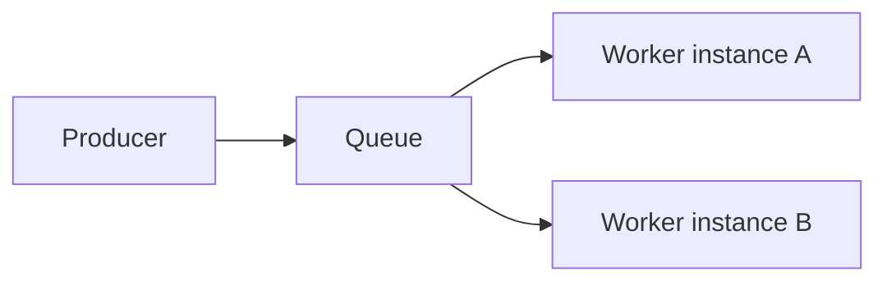
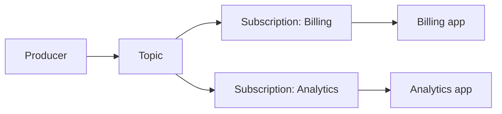

# Azure Service Bus — Queues vs Topics

## Series

1. [Why Messaging](../azure-service-bus--why-messaging/)
2. **Queues vs Topics** (this node)
3. [Reliability](../azure-service-bus--reliability/)
4. [Sessions & Competing Consumers](../azure-service-bus--sessions/)
5. [Practice](../azure-service-bus--practice/)

**Prev:** [← Why Messaging](../azure-service-bus--why-messaging/) ·
**Next:** [Reliability →](../azure-service-bus--reliability/)

## What it demonstrates

Point-to-point (**queues**) versus publish/subscribe (**topics** + **subscriptions**),
and a crisp rule for choosing between them.

## Key ideas

### Canonical rule

| Choose… | When… |
|---------|--------|
| **Queue** | One consuming *application* owns the work (many competing instances of that app are fine) |
| **Topic + subscriptions** | Independent subscribing *applications* each need their own copy / filter of the stream |

Competing consumers on a queue still share one logical consumer side — they race to
claim messages; each message is processed by **one** worker. That is not fan-out.

### Queue (point-to-point)

- One message → one successful completion across the competing set.
- Natural fit for “do this work once” command-style messages.

### Topic + subscriptions (pub/sub)

- One published message is copied (logically) to **each** subscription.
- Each subscription has its own backlog, lock semantics, and dead-letter queue.
- Filters can limit which messages a subscription receives.

### Decision checklist

1. Will more than one **independent product/team/app** consume the same event? → Topic.
2. Is the goal “exactly one handler application processes this work”? → Queue.
3. Need different apps to see different subsets? → Topic + subscription filters.

Practice in this series uses a **queue only**; topics stay conceptual here.

## How to use

No code in this node. Use the rule above when sketching a design, then read
[Reliability](../azure-service-bus--reliability/) for delivery guarantees.
