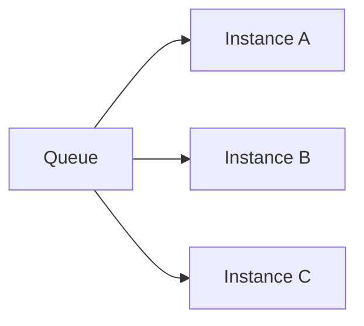
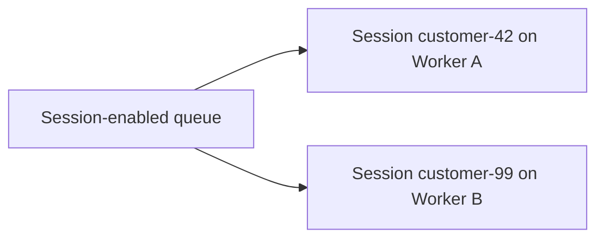

# Azure Service Bus — Sessions & Competing Consumers

## Series

1. [Why Messaging](../azure-service-bus--why-messaging/)
2. [Queues vs Topics](../azure-service-bus--queues-topics/)
3. [Reliability](../azure-service-bus--reliability/)
4. **Sessions & Competing Consumers** (this node)
5. [Practice](../azure-service-bus--practice/)

**Prev:** [← Reliability](../azure-service-bus--reliability/) ·
**Next:** [Practice →](../azure-service-bus--practice/)

## What it demonstrates

Two complementary scale/order patterns: **competing consumers** for throughput, and
**sessions** when a subset of messages must stay ordered and sticky to one worker.

## Key ideas

### Competing consumers

Multiple instances of the **same** consuming application pull from one queue (or one
subscription). Each message is locked by **one** worker; finished work is completed
once. Scale out workers to increase drain rate; you trade strict global order for
throughput.

Use when messages are independent (no “message 2 must wait for message 1”).

### Sessions (ordered subsets)

When a **group** of related messages must be processed in order (and usually by one
processor at a time), enable **sessions** and set `SessionId` (e.g. `customerId`,
`orderId`).

- The broker hands a session to **one** receiver at a time.
- Within that session, messages are delivered in order.
- Other sessions can be processed in parallel on other receivers.

Without sessions, competing consumers can interleave related messages and break
order assumptions.

### Choosing

| Requirement | Pattern |
|-------------|---------|
| Maximize throughput; messages independent | Competing consumers (no sessions) |
| Per-key ordering / sticky processing | Sessions (`SessionId` = the key) |
| Fan-out to different apps | Topic + subscriptions ([Queues vs Topics](../azure-service-bus--queues-topics/)) — still combine with either pattern **per subscription** |

### Practice note

[Practice](../azure-service-bus--practice/) uses a **non-session** queue and competing
consumers at the Function App scale unit — enough for the HTTP → queue → process →
DLQ loop. Sessions stay conceptual here.

## How to use

No code in this node. Capstone:
[Practice](../azure-service-bus--practice/) — enqueue via HTTP, process via queue trigger, force a DLQ path.
