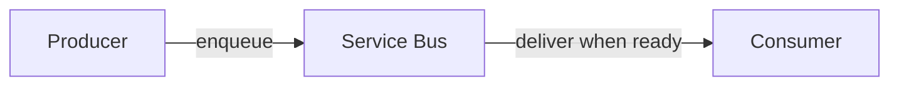

# Azure Service Bus — Why Messaging

## Series

1. **Why Messaging** (this node)
2. [Queues vs Topics](../azure-service-bus--queues-topics/)
3. [Reliability](../azure-service-bus--reliability/)
4. [Sessions & Competing Consumers](../azure-service-bus--sessions/)
5. [Practice](../azure-service-bus--practice/)

**Next:** [Queues vs Topics →](../azure-service-bus--queues-topics/)

## What it demonstrates

Why you introduce a message broker at all — before queues, topics, locks, or SDKs.

## Key ideas

**One-liner:** Messaging lets producers and consumers succeed independently — they
don't have to be ready, healthy, or scaled together.

That sentence covers three intertwined reasons teams reach for Service Bus (or any
broker):

| Need | Without messaging | With messaging |
|------|-------------------|----------------|
| **Decoupling** | Producer must know *who* handles work and call them now | Producer hands work to a queue/topic; consumers evolve on their own |
| **Load leveling** | A traffic spike hits consumers at request rate | The broker absorbs the spike; consumers drain at a sustainable rate |
| **Resilience** | If the consumer is down, the producer call fails | Messages wait; work resumes when the consumer recovers |

HTTP is a great *ingress* for “accept this request.” Messaging is the seam when
the *work* should not share that request’s lifetime.

Optional reading: the [Azure Functions series](../azure-functions--triggers-bindings/)
shows how a Function host can be a consumer; this series stays **broker-first**.

## How to use

No code in this node. Read the one-liner and table, then continue to
[Queues vs Topics](../azure-service-bus--queues-topics/) for *where* messages go.
