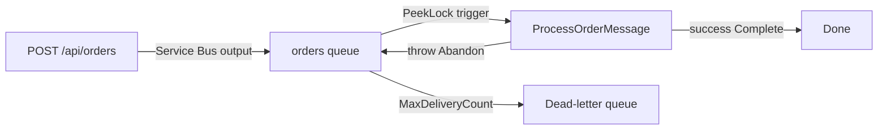

# Azure Service Bus — Practice (HTTP → Queue → DLQ)

## Series

1. [Why Messaging](../azure-service-bus-why-messaging/)
2. [Queues vs Topics](../azure-service-bus-queues-topics/)
3. [Reliability](../azure-service-bus-reliability/)
4. [Sessions & Competing Consumers](../azure-service-bus-sessions/)
5. **Practice** (this node)

**Prev:** [← Sessions & Competing Consumers](../azure-service-bus-sessions/)

## What it demonstrates

One **.NET 10 isolated** Function App that:

- **publishes** with an HTTP-triggered function (`EnqueueOrderHttp` + Service Bus output binding)
- **consumes** with a queue-triggered function (`ProcessOrderMessage`, PeekLock-style)
- **fails into the DLQ** when the payload sets `simulateFailure: true` (throw → abandon → MaxDeliveryCount)
- keeps rules in unit-tested services; functions stay thin glue
- uses a **connection string** locally; optional Azure notes use **Managed Identity + RBAC**

This is the series capstone. For Functions hosting/process-model depth, see the
[Azure Functions series](../azure-functions-triggers-bindings/) (light cross-link only).
The Functions practice node stays a separate, lighter receive example.

## Key ideas



- App settings: `OrdersQueueName`, `ServiceBusConnection` (local) or
  `ServiceBusConnection__fullyQualifiedNamespace` (identity in Azure).
- Lower `MaxDeliveryCount` on the queue (e.g. 3) makes the DLQ path easier to demo.
- Idempotency is a **comment checklist** on `OrderMessageProcessor` — not a store.

## How to run

### Prerequisites

- [.NET 10 SDK](https://dotnet.microsoft.com/download)
- [Azure Functions Core Tools](https://learn.microsoft.com/azure/azure-functions/functions-run-local) (`func`)
- [Azure CLI](https://learn.microsoft.com/cli/azure/install-azure-cli) (optional deploy path)
- Azurite (or another Storage emulator) for `AzureWebJobsStorage=UseDevelopmentStorage=true`
- A Service Bus namespace + **queue** (topics are out of scope for this practice)

### 1. Settings and tests

From `azure-service-bus-practice/`:

```bash
cp AzureServiceBusPractice/local.settings.json.example AzureServiceBusPractice/local.settings.json
# Edit ServiceBusConnection and OrdersQueueName as needed.

dotnet test
```

PowerShell:

```powershell
Copy-Item AzureServiceBusPractice\local.settings.json.example AzureServiceBusPractice\local.settings.json
dotnet test
```

### 2. Run locally

Start Azurite (if using development storage), then:

```bash
cd AzureServiceBusPractice
func start
```

Happy path — enqueue a message (function key appears in the `func start` console):

```bash
curl -X POST "http://localhost:7071/api/orders?code=YOUR_KEY" \
  -H "Content-Type: application/json" \
  -d '{"orderId":"ORD-1","itemCount":2}'
```

PowerShell:

```powershell
Invoke-RestMethod -Method Post "http://localhost:7071/api/orders?code=YOUR_KEY" `
  -ContentType "application/json" `
  -Body '{"orderId":"ORD-1","itemCount":2}'
```

Watch the console for `Service Bus order processed: ...`.

DLQ path — force abandon/retry until MaxDeliveryCount:

```bash
curl -X POST "http://localhost:7071/api/orders?code=YOUR_KEY" \
  -H "Content-Type: application/json" \
  -d '{"orderId":"ORD-POISON","itemCount":1,"simulateFailure":true}'
```

Then inspect the queue’s **dead-letter** subqueue in the portal (Service Bus Explorer)
or with Azure tools. You should see the poison message after enough failed deliveries.

Local auth options:

| Approach | `local.settings.json` |
|----------|------------------------|
| Connection string (simplest locally) | `"ServiceBusConnection": "Endpoint=sb://..."` |
| Identity-based (your Entra user) | `"ServiceBusConnection__fullyQualifiedNamespace": "ns.servicebus.windows.net"` and grant **Azure Service Bus Data Sender** + **Data Receiver** |

Do not commit real secrets — `local.settings.json` is gitignored.

### 3. Optional Azure notes (MI + RBAC)

Sign in and choose a Flex-capable region that supports your runtime:

```bash
az login
az functionapp list-flexconsumption-locations --query "sort_by(@, &name)[].{Region:name}" -o table
```

PowerShell:

```powershell
az login
az functionapp list-flexconsumption-locations --query "sort_by(@, &name)[].{Region:name}" -o table
```

Example variables (unique names required):

```bash
RG=rg-dev-codex-sb
LOCATION=eastus2
STORAGE=stdevcodexsb$RANDOM
APP=func-dev-codex-sb-$RANDOM
SB_NS=sb-dev-codex-$RANDOM
QUEUE=orders
```

PowerShell:

```powershell
$RG = "rg-dev-codex-sb"
$LOCATION = "eastus2"
$STORAGE = "stdevcodexsb$(Get-Random)"
$APP = "func-dev-codex-sb-$(Get-Random)"
$SB_NS = "sb-dev-codex-$(Get-Random)"
$QUEUE = "orders"
```

Create resources (Flex + .NET **10** isolated):

```bash
az group create --name "$RG" --location "$LOCATION"

az storage account create \
  --name "$STORAGE" \
  --location "$LOCATION" \
  --resource-group "$RG" \
  --sku Standard_LRS \
  --allow-blob-public-access false

az functionapp create \
  --resource-group "$RG" \
  --name "$APP" \
  --storage-account "$STORAGE" \
  --flexconsumption-location "$LOCATION" \
  --runtime dotnet-isolated \
  --runtime-version 10.0

az servicebus namespace create \
  --resource-group "$RG" \
  --name "$SB_NS" \
  --location "$LOCATION" \
  --sku Basic

az servicebus queue create \
  --resource-group "$RG" \
  --namespace-name "$SB_NS" \
  --name "$QUEUE" \
  --max-delivery-count 3
```

PowerShell:

```powershell
az group create --name $RG --location $LOCATION

az storage account create `
  --name $STORAGE `
  --location $LOCATION `
  --resource-group $RG `
  --sku Standard_LRS `
  --allow-blob-public-access false

az functionapp create `
  --resource-group $RG `
  --name $APP `
  --storage-account $STORAGE `
  --flexconsumption-location $LOCATION `
  --runtime dotnet-isolated `
  --runtime-version 10.0

az servicebus namespace create `
  --resource-group $RG `
  --name $SB_NS `
  --location $LOCATION `
  --sku Basic

az servicebus queue create `
  --resource-group $RG `
  --namespace-name $SB_NS `
  --name $QUEUE `
  --max-delivery-count 3
```

Enable system-assigned identity and grant sender + receiver on the namespace:

```bash
az functionapp identity assign --name "$APP" --resource-group "$RG"

PRINCIPAL=$(az functionapp identity show -g "$RG" -n "$APP" --query principalId -o tsv)
SB_ID=$(az servicebus namespace show -g "$RG" -n "$SB_NS" --query id -o tsv)

az role assignment create --assignee "$PRINCIPAL" --role "Azure Service Bus Data Sender" --scope "$SB_ID"
az role assignment create --assignee "$PRINCIPAL" --role "Azure Service Bus Data Receiver" --scope "$SB_ID"

az functionapp config appsettings set -g "$RG" -n "$APP" --settings \
  OrdersQueueName="$QUEUE" \
  ServiceBusConnection__fullyQualifiedNamespace="${SB_NS}.servicebus.windows.net"
```

PowerShell:

```powershell
az functionapp identity assign --name $APP --resource-group $RG

$principal = az functionapp identity show -g $RG -n $APP --query principalId -o tsv
$sbId = az servicebus namespace show -g $RG -n $SB_NS --query id -o tsv

az role assignment create --assignee $principal --role "Azure Service Bus Data Sender" --scope $sbId
az role assignment create --assignee $principal --role "Azure Service Bus Data Receiver" --scope $sbId

az functionapp config appsettings set -g $RG -n $APP --settings `
  "OrdersQueueName=$QUEUE" `
  "ServiceBusConnection__fullyQualifiedNamespace=$SB_NS.servicebus.windows.net"
```

Publish:

```bash
cd AzureServiceBusPractice
func azure functionapp publish "$APP"
```

PowerShell:

```powershell
Set-Location AzureServiceBusPractice
func azure functionapp publish $APP
```

## Layout

| Path | Role |
|------|------|
| `AzureServiceBusPractice/Program.cs` | Isolated host builder, DI |
| `AzureServiceBusPractice/Functions/EnqueueOrderHttp.cs` | HTTP publish + Service Bus output |
| `AzureServiceBusPractice/Functions/ProcessOrderMessage.cs` | Queue trigger; throw → DLQ path |
| `AzureServiceBusPractice/Services/` | Pure parse / process logic |
| `AzureServiceBusPractice/local.settings.json.example` | Local settings template |
| `AzureServiceBusPractice.Tests/` | Unit tests for services |

## References

- [Service Bus trigger](https://learn.microsoft.com/azure/azure-functions/functions-bindings-service-bus-trigger)
- [Service Bus output binding](https://learn.microsoft.com/azure/azure-functions/functions-bindings-service-bus-output)
- [Identity-based connections](https://learn.microsoft.com/azure/azure-functions/functions-identity-based-connections-tutorial-2)
- [Dead-letter queues](https://learn.microsoft.com/azure/service-bus-messaging/service-bus-dead-letter-queues)
