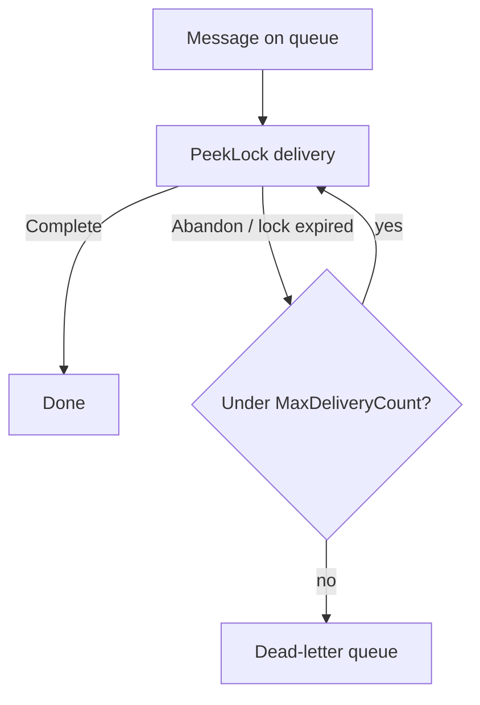

# Azure Service Bus — Reliability

## Series

1. [Why Messaging](../azure-service-bus-why-messaging/)
2. [Queues vs Topics](../azure-service-bus-queues-topics/)
3. **Reliability** (this node)
4. [Sessions & Competing Consumers](../azure-service-bus-sessions/)
5. [Practice](../azure-service-bus-practice/)

**Prev:** [← Queues vs Topics](../azure-service-bus-queues-topics/) ·
**Next:** [Sessions & Competing Consumers →](../azure-service-bus-sessions/)

## What it demonstrates

Core delivery semantics for Service Bus: at-least-once delivery, locks, retries,
dead-letter queues (DLQ), and why consumers must be idempotent.

## Key ideas

### At-least-once delivery

Service Bus will deliver a message **at least once**. After a crash, timeout, or
abandon, another delivery can occur. Design for duplicates — do **not** assume
exactly-once processing unless you add your own idempotency.

### PeekLock vs ReceiveAndDelete

| Mode | Behavior | Prefer when… |
|------|----------|--------------|
| **PeekLock** (recommended almost always) | Broker locks the message; complete on success; abandon/unlock on failure | Processing can fail and must be retried safely |
| **ReceiveAndDelete** | Message is removed as soon as it is received | Losing a message is acceptable and work is tiny / instantly durable elsewhere |

If the process dies mid-work under ReceiveAndDelete, the message is already gone.

### Retries and back-off

When a PeekLock holder abandons (or the lock expires), the message becomes
available again. Delivery count increases. Pair broker retries with cautious
app-level back-off for transient downstream faults — but remember the broker is
already redelivering.

### Dead-letter queue (DLQ)

After **MaxDeliveryCount** failed deliveries (or an explicit dead-letter), the
message moves to the entity’s DLQ. Use the DLQ for poison messages and ops triage —
not as the happy path.

### Idempotency (checklist)

Because of at-least-once:

1. Prefer an **idempotency key** (e.g. `MessageId` / business `orderId`).
2. Record “already processed” in durable storage before side effects — or make
   side effects themselves idempotent.
3. Treat redelivery as normal, not exceptional.

(Practice comments this checklist; it does not implement a store.)

### Practice host aside

Azure Functions Service Bus triggers use **lock-based** (PeekLock-style) receive.
Throwing from the function abandons the message so it can retry and eventually DLQ.
See [Practice](../azure-service-bus-practice/).

## How to use

No code in this node. Continue to
[Sessions & Competing Consumers](../azure-service-bus-sessions/) for ordering and scale-out.
